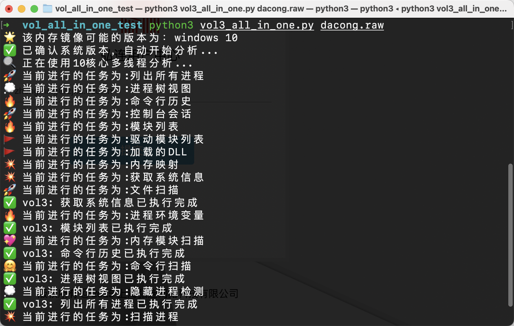

## 一个多线程Vol3自动化脚本

适用于CTF比赛中简单的内存取证题目，可以自动化运行Vol3内默认的所有插件，然后以文本形式保存到`vol_output`文件夹下，方便下一步分析。

### 运行效果



### 使用方式

```bash
python3 vol3_all_in_one.py image.raw
```

### 测试情况

Windows7、Windows10

Linux和MacOS还未测试

### 曾经的一些幻想

再做一个vol2和vol3联合分析，互相补足相同功能有时一个会失效的情况；然后实现图形化，这样就有一个Lovelymem免费版了

但是Lovelymem开源了（？